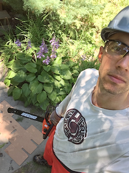
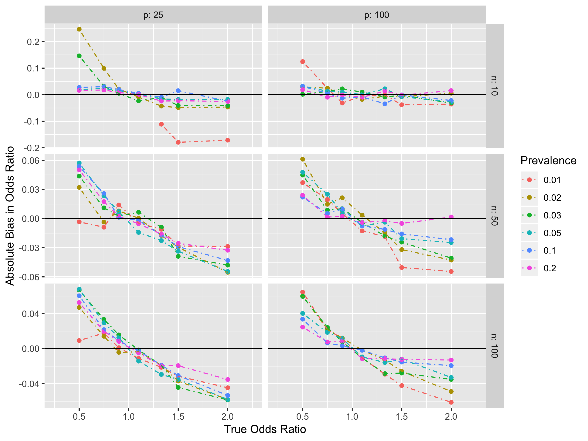

# Josh Nugent

I am a PhD student in Biostatistics at the University of Massachusetts, studying causal inference (with [Laura Balzer](https://www.balzerlab.com/)) and cluster-randomized trials (with [Ken Kleinman](https://www.kleinman.science/)).

## Projects:
Investigating bias in penalized quasi-likelihood (PQL) estimation for generalized linear mixed models with dichotomous outcomes. Paper in process.

